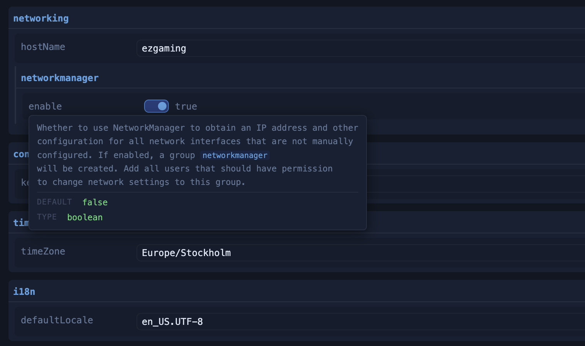
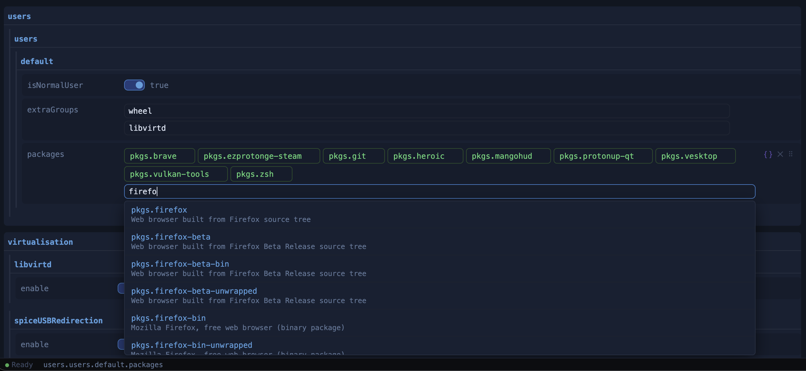
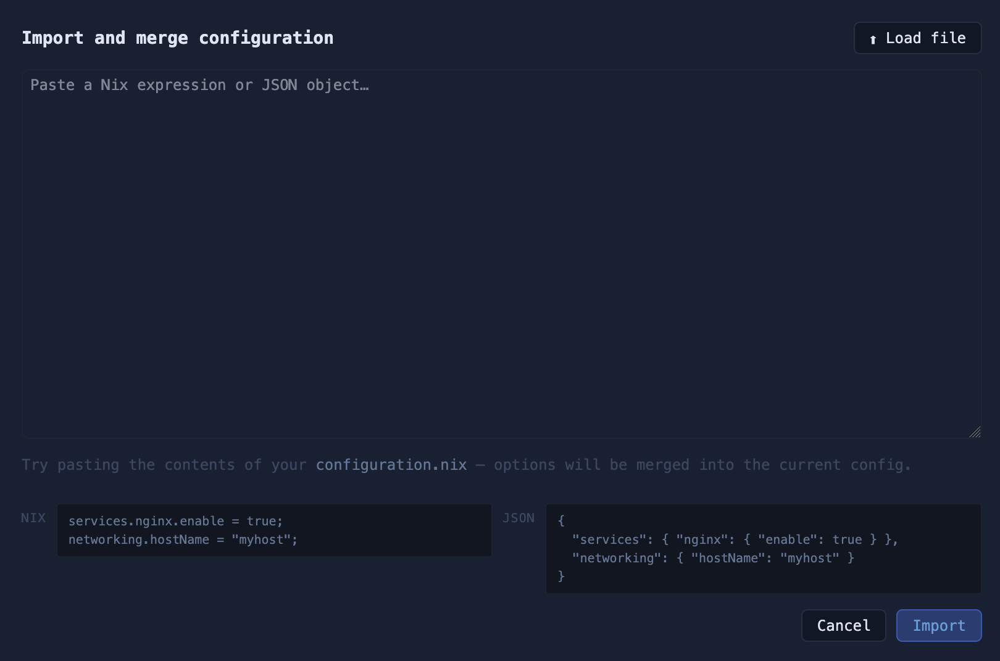
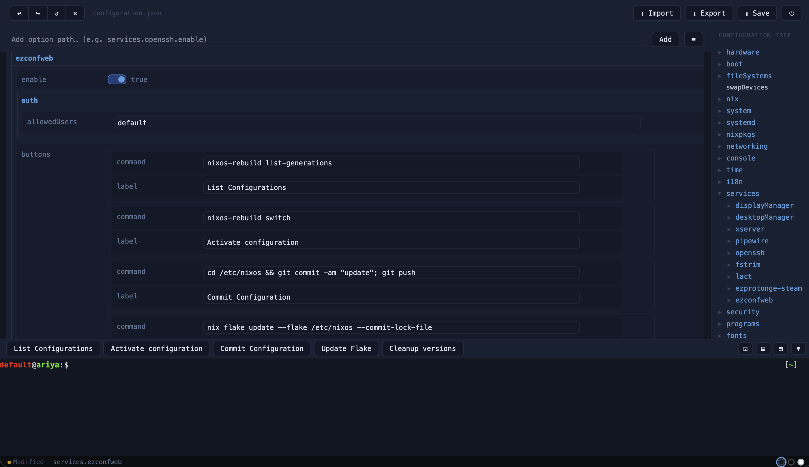

# ezconfweb — a GUI for NixOS configuration

NixOS is powerful but its configuration format can be a barrier: a deeply nested `.nix` file with thousands of possible options, unfamiliar syntax, and no built-in UI. [ezconfweb](https://github.com/kalken/ezconfweb) is a small web app that turns that file into a browsable, searchable, autocompleting editor — without a need for a build system or a bundler.

## Why JSON for a NixOS config?

It might seem odd to store a NixOS configuration as JSON — Nix has its own expression language, after all, and most configs live in `.nix` files. But a configuration tree is fundamentally just nested key-value data, and JSON maps onto that perfectly. You get a predictable structure that any language can read, write, and diff without a Nix evaluator installed.

What makes this work cleanly in NixOS is that Nix has first-class JSON support built in. `builtins.fromJSON` and `builtins.toJSON` are core builtins, and NixOS modules can consume JSON files directly. So the app writes a `configuration.json`, and a thin Nix wrapper reads it with `builtins.fromJSON` and merges it into the module system — no code generation, no template rendering.

The trade-off is that pure JSON can't express Nix-specific values like package references or arbitrary expressions. ezconfweb handles this with the `_expr` sentinel: any value that needs to be raw Nix is stored as `{ "_expr": "pkgs.vim" }` and unwrapped at the Nix layer. It's a small seam, and it keeps the rest of the config as plain, portable data.

## The interesting part: autocomplete over a dynamic schema

NixOS has thousands of options, many of which use dynamic keys — `users.users.<name>.packages`, `services.<name>.enable`, and so on. Autocomplete options and documentation are automatically generated at first service start and can be updated manually within the GUI. When you type `users.users.` into the add-field input, the app detects the wildcard boundary and suggests your existing usernames as continuations.

The app also supports importing an existing `configuration.nix` file, which is useful when migrating to ezconfweb from a hand-written config. The frontend includes a small custom Nix parser that converts the file into the JSON representation. It handles the common cases well: attribute sets, lists, strings (including indented strings), booleans, `with pkgs; [...]` package lists, and dotted key paths. The limitation is that it's a data-oriented parser, not a full Nix evaluator — anything beyond plain data, like `if/then/else`, `let` bindings, `import`, or function calls, is not supported. That kind of logic needs to be handled outside the `configuration.json`, in a separate Nix file.

## Configured like any other service

The quick-access buttons visible in the toolbar — things like running `nixos-rebuild switch` or listing generations — are not hardcoded. They're defined in the NixOS configuration itself, under `services.ezconfweb`, just like you'd configure any other service. This means the buttons, their labels, and the commands they run are all part of your system config and tracked in version control alongside everything else.

## Architecture

The project has three independent pieces:

**A Python web server** (`server.py`) handles authentication, serves static assets, and exposes two API endpoints — one to write the config back to disk, one to regenerate autocomplete data. Auth supports PAM (system credentials) or a custom username/password. A 32-byte session key is generated at startup, injected into the HTML at serve-time, and persisted to a file so server restarts don't invalidate open sessions.

**A vanilla JS frontend** (`webroot/index.html`) is the entire UI: ~1400 lines, no modules, no framework. Every state mutation calls `renderAll()`, which rebuilds the sidebar tree and the main editor panel from scratch. It sounds expensive but works fine in practice — configs are not huge, and the simplicity avoids an entire class of stale-state bugs.

**A terminal service** (`terminal.py`) runs as a separate process and bridges WebSocket connections to a PTY session, so you can run `nixos-rebuild switch` right in the browser.

## No build system

The whole frontend is a single HTML file you can open in any editor and deploy by copying. Theming is done with CSS custom properties; three theme files (`theme-nixos.css`, `theme-dark.css`, `theme-light.css`) just override the variables. The Nix flake wraps everything into proper NixOS systemd services, but the core of the project is just files.
## A starting point, not a ceiling

ezconfweb is one take on what graphical NixOS configuration could look like — but it's hardly the only approach. The underlying idea is simple: NixOS modules expose structured, documented options, and JSON maps cleanly onto that structure. Everything else is just UI. It's possible to build something far more familiar — like the settings panels you'd find on other operating systems — and the same principles would apply.

I'm not a designer, and I'm sure there's a lot of room to make this simpler and more approachable. If you have ideas or feedback on how the interface could be improved, I'd genuinely love to hear it.
